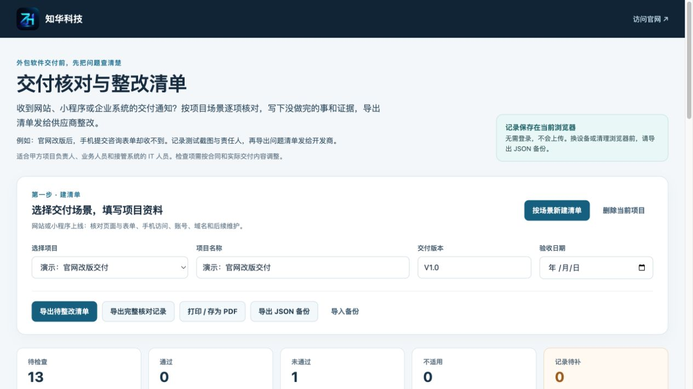
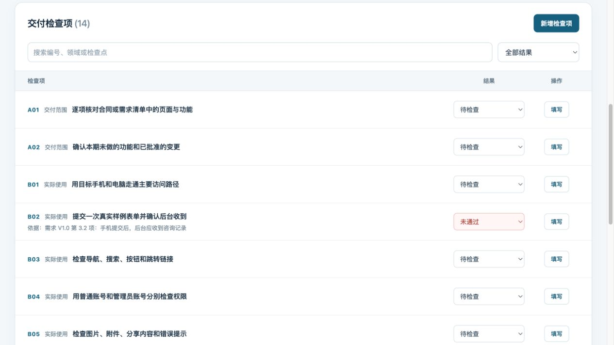
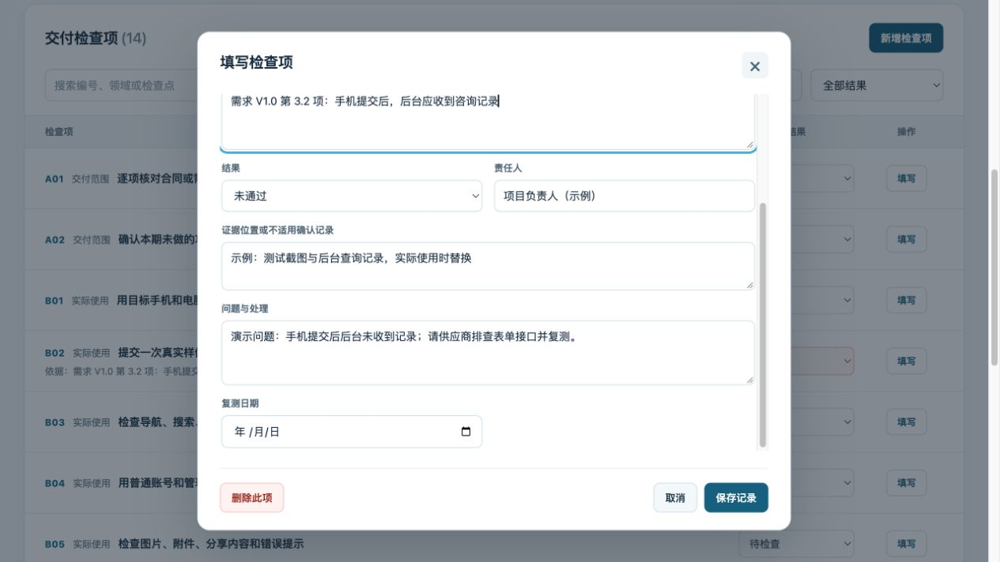

[中文](README.md) | [English](README.en.md)

# ZhiHua Acceptance Checklist · Software Delivery Review and Remediation

**ZhiHua Technology (Shanghai Rujing Zhihua Information Technology Co., Ltd.)** · [Official website](https://www.zhuatech.cn/).

A static HTML, CSS and JavaScript tool for client project owners, business reviewers and IT teams taking over outsourced software. Build a checklist for a website, mini-program, business system or source/operations handover, record unfinished work and export remediation records for the supplier. Data stays in the current browser's local storage.

This is public source for personal learning, technical research and non-commercial exchange. The existing [Community Source LICENSE](LICENSE) and [NOTICE](NOTICE) require written authorization from Shanghai Rujing Zhihua Information Technology Co., Ltd. for commercial use, including internal business production, commercial deployment, SaaS and paid delivery. This is not an OSI open-source license. Free use of the company's hosted web tool does not grant commercial rights to its source.

## Use cases and workflow

A supplier's delivery notice may not show which functions, accounts or source files have actually been handed over. Use the relevant scene template, fill in project name/version/review date, and check actual contract and requirement evidence. Templates are prompts, not an agreed contract or acceptance decision.

For example, in a fictional website handover, submitting a test inquiry from a phone fails to create a backend record. Mark the check as failed, state the contract/requirement reference, evidence location, corrective action, responsible person and retest date. Export the failed-items CSV for supplier review. After a fix, reopen the same project, retest and update the record. The application does not submit the form or test the delivered system automatically.

[See a fictional remediation CSV example](docs/示例-官网改版待整改清单.csv).

## Implemented features

| Function | Behavior |
| --- | --- |
| Scene templates | Website/mini-program launch, enterprise-system delivery and source/operations handover |
| Project records | Create/switch projects, name/version/date fields and per-project checks |
| Check editing | Add, edit or delete project-specific checks; record criteria, result, evidence, issue, owner and retest date |
| Review status | Pending, passed, failed or not applicable; filter/search and manual-state counts |
| Missing-record reminders | Flag selected outcomes without required criteria, evidence, issue handling or responsibility |
| Supplier remediation | Export only failed checks to CSV |
| Full records | Export the current project's full CSV; print or use browser Save as PDF |
| Backup | Export all projects as JSON and import into another browser after structural validation |
| Local storage | No login or server upload; each browser/origin has its own records |

Project owners and reviewers use one local interface. Suppliers receive exported files for reconciliation. There is no separate user/admin portal, account management or permission system. CSV and printed business records contain no inserted advertising.

## Actual interface screenshots

These three actual views use a fictional website-delivery project: project overview/statistics, checklist and issue editor. There are no login or administration screens to demonstrate.

Project details and counts summarize manually recorded outcomes.



The checklist lets reviewers inspect individual delivery checks and mark failures.



The editor records agreed criteria, responsible person, evidence location, issue handling and retest date.



## Hosted trial

[Open the delivery checklist](https://zhuatech-han.github.io/zhuatech-acceptance-checklist/). The existing trial is hosted on GitHub Pages and requires access to that domain. Self-hosting uses your own site address. The current application interface is Chinese; bilingual READMEs do not mean an English runtime interface.

## Architecture and directories

The browser loads static assets and stores records in `localStorage`. There is no backend, database service, cloud synchronization or third-party runtime dependency. Evidence fields store text references/links rather than uploading screenshots or attachments.

```text
src/index.html      Page, checklist and editing dialogs
src/app.js          Interaction, local persistence, import/export and printing
src/core.js         Templates, validation, counts and CSV
src/styles.css      Screen and print styles
scripts/build.mjs   Copy source assets into dist
scripts/dev.mjs     Local-only preview server
tests/core.test.mjs Scene, record, CSV and backup tests
docs/               Chinese manual, actual screenshots and fictional sample
Dockerfile / compose.yaml  Optional Nginx container deployment
.env.example        Container bind address and port
deploy/nginx.conf   Static routing and /health
LICENSE / NOTICE    Existing own-source license and attribution
```

## Environment and startup

Use Node.js 24 or later and a modern browser supporting JavaScript modules and local storage. The project has no third-party runtime dependencies and requires no package installation.

From the repository root:

```sh
npm run dev
```

This builds the static assets and starts a server listening only on localhost. Open [http://127.0.0.1:4174/](http://127.0.0.1:4174/).

To change the preview port, for example to avoid another running project:

```sh
PORT=18183 npm run dev
```

Node preview requires no `.env`, database credentials, API keys or third-party integrations. Optional container configuration is listed in [.env.example](.env.example).

## Initialization, storage and backup

First opening creates a blank enterprise-system project with 21 pending prompts; it does not prefill passing conclusions. Schema version is 1, under storage key `zhuatech.acceptance-record.v1`. There is no database initialization, migration script or server account.

Import validates JSON version, fields, unique identifiers and result states; tests cover existing backup compatibility. Import replaces all projects in the current browser, so export a backup first. An export contains all projects; current-project CSV/printing includes that project's written content. Review the contents before sharing because they may contain client/contract information.

Changing site domain, port, device or browser does not automatically move records. Export/import JSON to transfer them. Back up before clearing browser data or using private browsing. Storage failure shows a warning to export immediately; there is no server copy.

## Tests and build

Run from the root:

```sh
npm run lint
npm test
npm run build
```

`lint` performs JavaScript syntax checks; there is no separate formatter configured. Six Node tests cover default pending prompts, missing evidence/responsibility, scene templates and old backups, CSV quoting/formula neutralization, failed-only export and backup round-trip/rejection of invalid or duplicate records.

There is no business backend or MySQL database, so backend/database/migration checks are not applicable. The existing optional Docker Compose deployment provides a static Nginx service and requires its own configuration, image and health checks. Browser editing and persistence must be verified separately; automated data tests do not certify a delivered customer's software.

## Static deployment and upgrades

`npm run build` produces `dist/` with `index.html`, CSS, JavaScript modules and the logo. Deploy those files to a static HTTPS host accessible to intended reviewers. The existing root landing file redirects to `./dist/`; serving `dist/` directly uses its own index. No application server/database setup is required.

Each browser still stores its own data; deploying static assets does not add synchronization. Before upgrading or moving the site, export JSON and verify restoration in an isolated browser. Keep client backups outside the source and deployment package. See the Chinese [operations manual](docs/操作手册.md) for records, evidence and exports.

### Existing Docker Compose deployment

Docker/Compose serves the same browser-local application through Nginx 1.29. Its Node 24.19 build stage runs syntax checks, tests and asset generation; there is no server-side business state.

```sh
docker compose config --quiet
docker compose up --build -d --wait
```

Default address: `http://127.0.0.1:4174/`; health: `/health`. `WEB_BIND_ADDRESS` defaults to `127.0.0.1`; `WEB_PORT` defaults to `4174` and can be changed, for example to `18174`. No passwords are needed. The Dockerfile uses a non-root Nginx runtime without CDN dependencies. Stop this service with `docker compose down`; browser records remain in their original site origin.

The root [CONTRIBUTING.md](CONTRIBUTING.md) and [SECURITY.md](SECURITY.md) describe contribution and private security reporting. Run `npm run check:release` (or `node scripts/verify-release.mjs`) to check README images, both original QR assets, licensing and example configuration; it does not replace actual workflow or deployment checks.

## Known limits and feedback

At most 50 projects and 500 checks per project are accepted; imports must be at most 10 MB. Browser storage quotas/permissions may impose additional constraints. Records are manual, with no multi-person live collaboration, access control, electronic signing, automatic tests or automatic acceptance decision. PDF output uses the browser's print feature. This is not a verified production acceptance service.

Use repository Issues for reproducible problems with synthetic data, expected/actual results and the browser/version used. Do not include real credentials, customer records or private backups. Source contains no actual customer data. Commercial source use and derivative implementation remain subject to the existing [LICENSE](LICENSE) and [NOTICE](NOTICE), without free-commercial-use MIT/Apache terms.

## Contact ZhiHua Technology

**ZhiHua Technology (Shanghai Rujing Zhihua Information Technology Co., Ltd.)** · [https://www.zhuatech.cn/](https://www.zhuatech.cn/).

For commercial licensing, customization, delivery review, system takeover, remediation development, independent deployment and system integration:

- Email: [han@zhuatech.cn](mailto:han@zhuatech.cn)
- Email: [jack@zhuatech.cn](mailto:jack@zhuatech.cn)
- WhatsApp: [+86 17521234993](https://wa.me/8617521234993)

Web-tool usage rights and source commercial rights remain separate.
