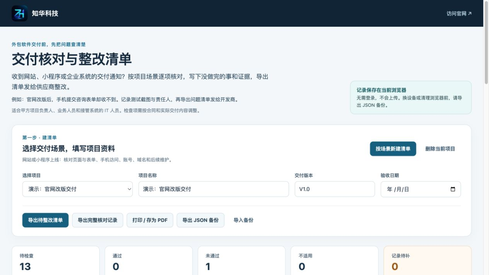
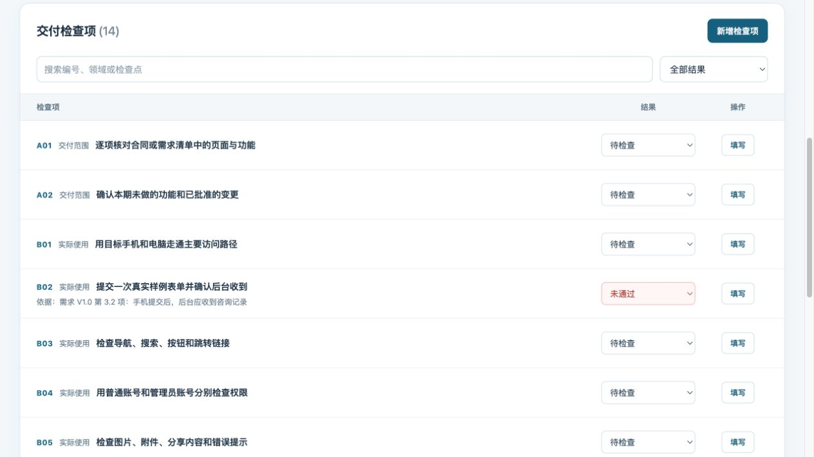
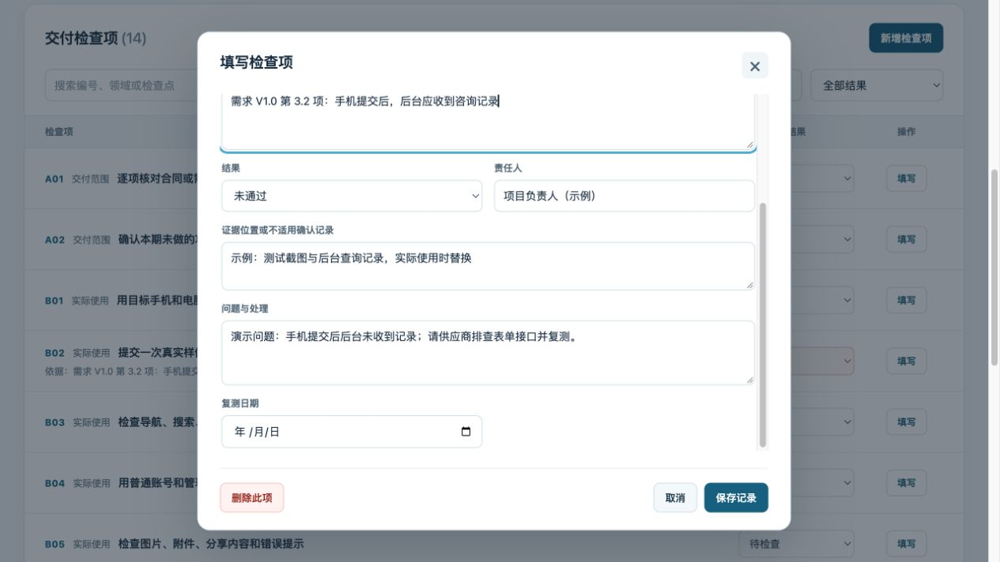

# 知华科技 · 外包软件交付核对与整改清单

供应商说“网站、小程序或企业系统可以交付了”，甲方却不确定哪些功能已做完、哪些账号和源码已经交接。知华科技（上海如静知华信息科技有限公司）提供这个免费网页工具，让甲方项目负责人、业务人员和接管系统的 IT 人员按场景建立清单，现场记录未完成事项，并导出待整改清单给供应商核对。

例如，官网改版交付时，甲方用手机提交测试咨询表单，发现后台没有收到。可把这一项标记为“未通过”，写明合同或需求依据、测试时间、截图位置、处理负责人和复测日期，再导出待整改 CSV。供应商修复后，甲方回到同一份记录复测。预置检查点只是提示，实际标准仍以合同、需求版本和双方确认的证据为准。

[查看虚构的待整改清单导出样例](docs/示例-官网改版待整改清单.csv)。

## 界面预览

以下页面使用虚构的“官网改版交付”项目演示。







## 在线试用

[打开交付核对与整改清单](https://zhuatech-han.github.io/zhuatech-acceptance-checklist/)。试用页面托管在 GitHub Pages，访问时需要能连接该域名的网络环境；自行部署后，使用者只需访问自行配置的站点地址。

## 功能

- 按“网站或小程序上线”“企业管理系统交付”“源码与运维资料移交”建立清单；也能新增、修改或删除项目专属检查项。
- 逐项填写和按结果筛选；对已标记“通过”“未通过”或“不适用”但缺少依据、证据或处理责任的记录给出提示。
- 只把“未通过”项导出为待整改 CSV，也能导出完整记录、打印或存为 PDF；全部项目可导出 JSON 备份并在另一浏览器导入。
- 页面不要求登录，项目内容不上传服务器。CSV 和打印结果不插入商业广告。

这个工具适合一次交付核对和整改沟通，不提供多人实时协作或正式电子签署。结果统计只反映人工填写状态，不自动作出项目是否通过验收的结论。换设备、使用无痕模式或清理浏览器数据前，请先导出 JSON 备份。导入备份会替换当前浏览器中的全部项目。

## 本地运行

需要 Node.js 24 或更高版本。项目没有第三方运行依赖。

```sh
npm run dev
```

打开 `http://127.0.0.1:4174/`。本机预览只监听本机地址。检查源码与生成文件：

```sh
npm run lint
npm test
npm run build
```

生成的 `dist/` 是静态站点文件，可部署到支持 HTTPS 的静态站点。部署时请确保项目使用者能访问目标域名；使用者的浏览器仍各自保存自己的记录，静态站点不会跨设备同步数据。更多步骤见[操作手册](docs/操作手册.md)。

## 数据与授权

浏览器本地保存记录、项目元数据和检查项。JSON 备份包含全部项目的填写内容，CSV 和打印结果包含当前项目的填写内容；分享前请核对是否包含客户资料。源码不包含真实客户数据。

知华科技运营的网页工具可免费使用。公开的源码为社区源码版，知华科技自有代码按 [LICENSE](LICENSE) 和 [NOTICE](NOTICE) 仅许可自然人用于个人学习、研究和非商业交流；企业内部生产、商业部署、SaaS、收费交付或源码二次开发商用，须先取得知华科技书面授权。网页使用权不包含源码商用权。

## 联系知华科技

如果核对时发现源码、数据、接口或部署资料无法接管，可说明项目类型、当前卡点和计划时间，咨询交付检查、系统接管、补救开发或独立部署。

- 官网：[www.zhuatech.cn](https://www.zhuatech.cn/)
- 商业授权、定制开发、部署与系统集成咨询微信：`zhuatech`、`zhuatech2`

| 微信 zhuatech | 微信 zhuatech2 |
| --- | --- |
|  |  |
